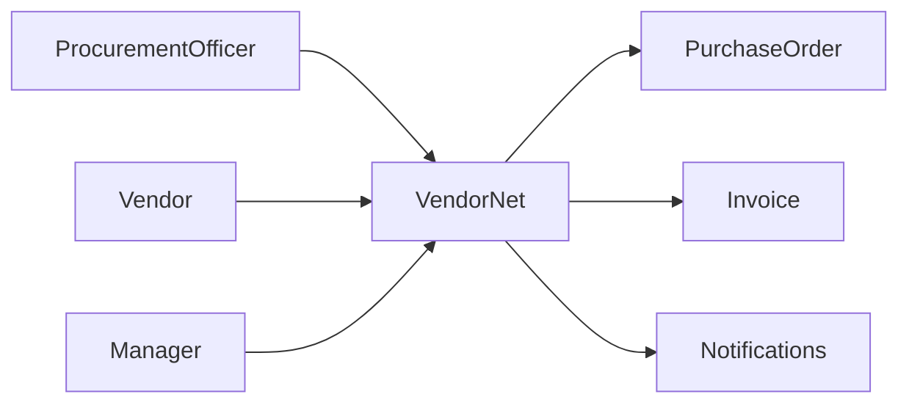
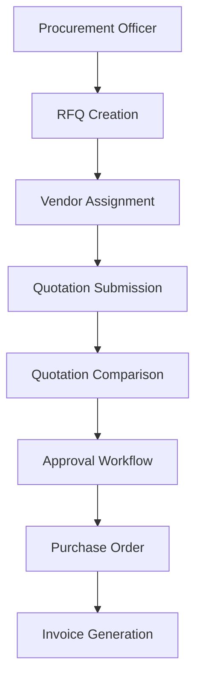

# Data Flow Diagram (DFD)

## Level 0



## Level 1



## Process Flow

1. Procurement Officer creates RFQ.
2. Vendors receive RFQ.
3. Vendors submit quotations.
4. Quotations are compared.
5. Manager approves/rejects.
6. Purchase Order generated.
7. Invoice generated.
8. Procurement activity tracked.

```
```
