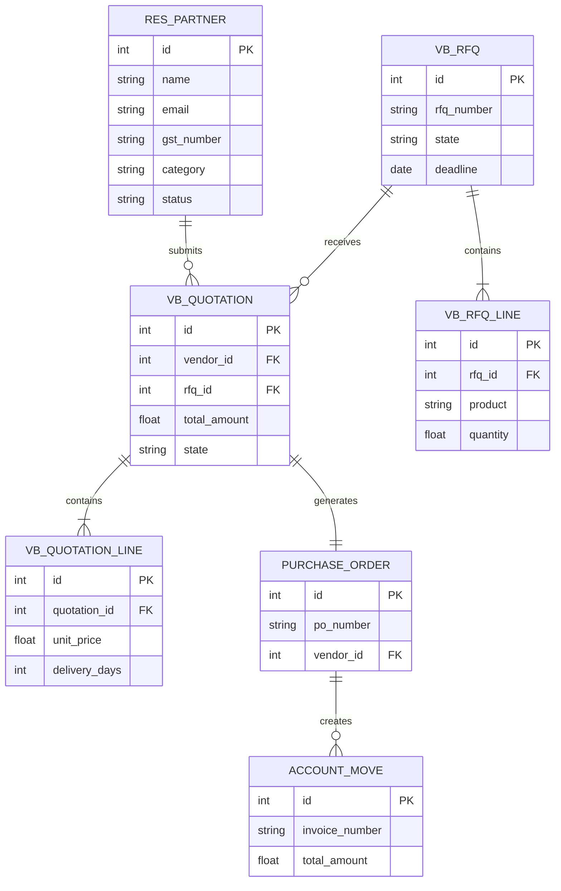

# Entity Relationship Diagram (ERD)



## Core Entities

* Vendor
* RFQ
* RFQ Line
* Quotation
* Quotation Line
* Purchase Order
* Invoice

The workflow follows:

Vendor → RFQ → Quotation → Approval → Purchase Order → Invoice

```
```
