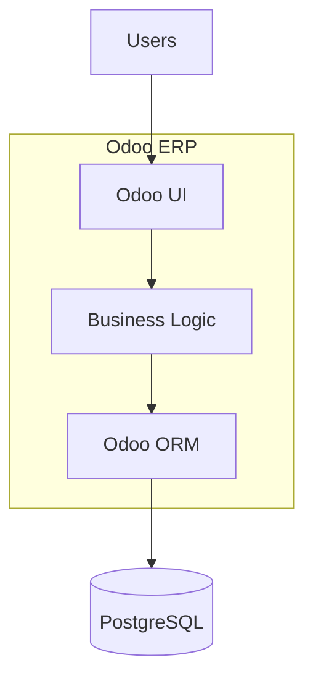

# System Design

## High Level Architecture



## Components

### Presentation Layer

* Odoo Web Client
* Forms
* Lists
* Dashboards

### Application Layer

* Vendor Management
* RFQ Management
* Quotation Management
* Approval Workflow
* Purchase Order Generation
* Invoice Generation

### Data Layer

* PostgreSQL
* Odoo ORM

## Security

* Admin
* Procurement Officer
* Vendor
* Manager

Role-based access control is enforced through Odoo Security Groups and Record Rules.

```
```

