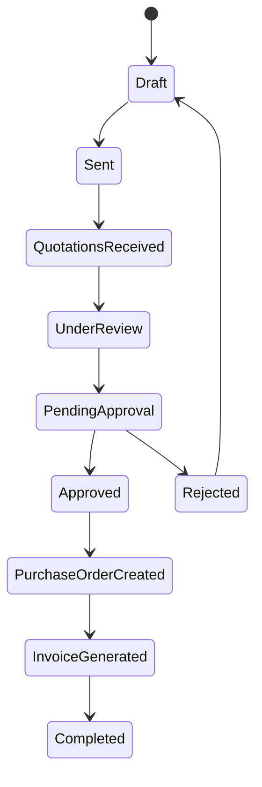

# Procurement Workflow



## Workflow Steps

1. Create RFQ
2. Assign Vendors
3. Send RFQ
4. Receive Quotations
5. Compare Quotations
6. Select Winning Vendor
7. Submit for Approval
8. Generate Purchase Order
9. Generate Invoice
10. Email / Print Invoice

## User Roles

### Admin

* Manage users
* Manage vendors
* View analytics

### Procurement Officer

* Create RFQs
* Compare quotations
* Generate POs
* Generate invoices

### Vendor

* Submit quotations
* View RFQ status
* View purchase orders

### Manager

* Approve or reject requests
* Monitor workflows
* View analytics

```
```

